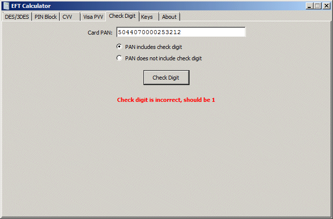

The **Check Digit** application tab is where you can verify the check digit of a PAN or find the check digit of a PAN.

To verify a PAN, enter it in the **Card PAN** text box, select the option **PAN includes check digit** and press the **Check Digit** button. The application will calculate the correct check digit. If it is different than the entered PAN check digit, the application will display the calculated one.

To just calculate a check digit, enter the card PAN without the check digit, select the **PAN does not include check digit** option and press the **Check Digit** button.