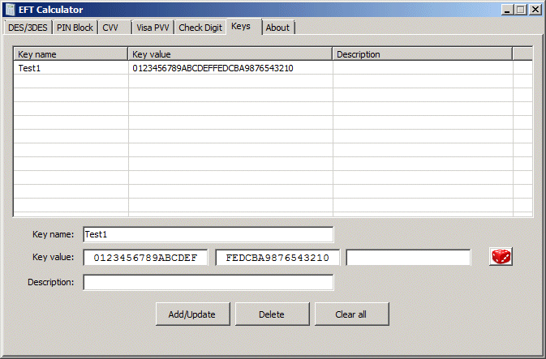

EFT calculator can save keys that you repeatedly use in a text file. To create, change or delete keys, click on the **Keys** application tab.

The list displays the keys known to the application. To enter a new key, enter the key information and press the **Add/Update** button. To change a key, select the key from the list, perform the necessary changes and press the **Add/Update** button. To delete a key, select it from the list and press the **Delete** button.

Once keys are configured, they can be accessed from the program and entered in corresponding text boxes by pressing the key-like icon that appears next to them.