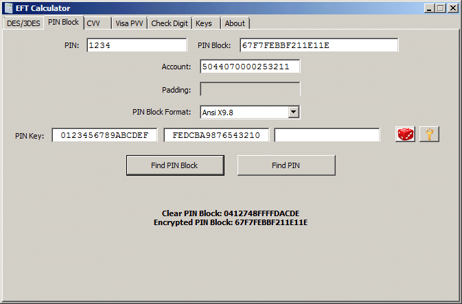

Click on the **PIN Block** application tab to calculate PIN blocks and find the PIN from a PIN block.

Select a PIN block format and enter the information appropriate to find the PIN block. All PIN block formats require a PIN. Some PIN block formats additionally require an account number and/or a padding string. After entering the PIN encryption key, clicking on the **Find PIN Block** button will calculate the clear and encrypted PIN blocks.

The reverse process is to find the clear PIN from a PIN block. To do that the encrypted PIN block instead of the PIN is required, the rest of the information is the same. Clicking on the **Find PIN** button will attempt to find the clear PIN that corresponds to the encrypted PIN block.