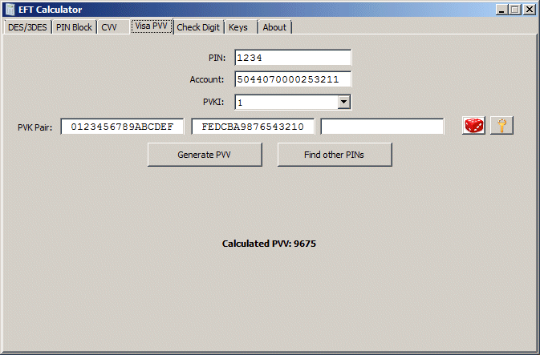

The **Visa PVV** application tab allows you to calculate a Visa PIN Verification Value.

Enter a PIN and a card PAN, select a PVKI and a PVK pair, then click on the **Generate PVV** button to calculate the PVV for those values.

For the same values, you can also click on the **Find other PINs** button to calculate all PINs that match the generated PVV. In addition, the application will calculate the distribution of PIN values to PVVs - that is, how many unique PINs exist for a card, how many PVVs that match to two, three, four or more PINs.

