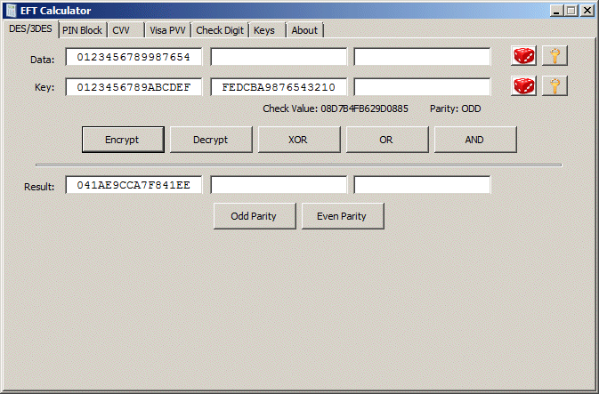

DES and 3DES operations are performed in the corresponding application tab.

Data information is entered on top and the key is entered below that. Clicking on the **Encrypt** and **Decrypt** performs the corresponding operation and the result is displayed below. In addition to the operation, the application calculates the [key check value](key-check-value) and also determines the parity of the key used. This information is displayed below the key.

Once the result is determined, the application can force odd or even bit parity on the result by clicking on the **Odd Parity** or **Even Parity** buttons.

In addition to the DES/3DES operations, the application can also perform bitwise AND/OR/XOR operations between the data and the key. This is done by clicking on the **AND**, **OR** and **XOR** buttons.